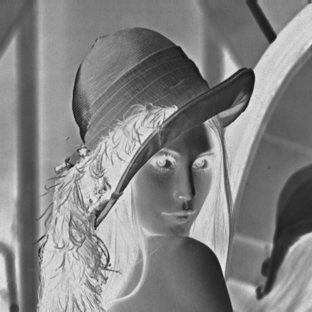
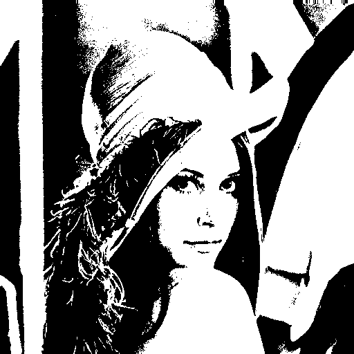
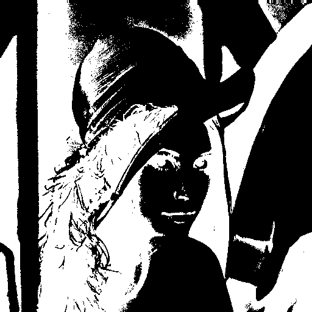
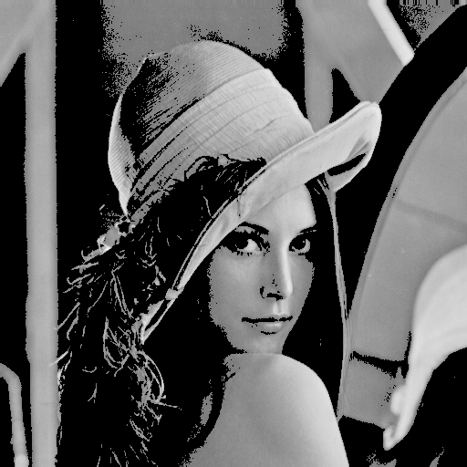
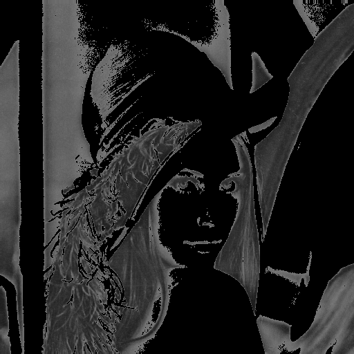
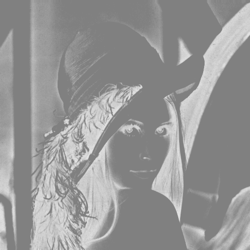

imagewizard
-----------

imagewizard is a python based library for performing various image manipulations and operations,

1. `Image Hashing <https://github.com/Swaroop-p/imagewizard#image-hashing>`_
2. `Image Similarity (hash distance computation) <https://github.com/Swaroop-p/imagewizard#image-similarity-hash-distance>`_
3. `Image Processing and Transformations <https://github.com/Swaroop-p/imagewizard#image-processing--transformations>`_
4. `Image Analysis <https://github.com/Swaroop-p/imagewizard#image-analysis>`_

Image Hashing
=============

Intuition
_________

Given an imput image, imagewizard can compute a hash for the image based on it visual appearance. It is understood that images that are perceptually similar must have similar hashes as well. The similarity here is a metric that we can choose to compute on, generally hamming distance is considered, but we can choose other distance metrics too.
By utilizing imagewizard we can find near-identical images in constant time, or at worst, O(log n).

imagewizard supports the following hashing techniques:

* average hashing (`a Hash`_)
* perception hashing (`p Hash`_)
* difference hashing (`d Hash`_)
* wavelet hashing (`w Hash`_)

Basic Usage
___________

Let's take a look at how we can implement image hashing using imagewizard. We will use PIL/Pillow and OpenCv2-python image libraries to read an image and get a 8x8 hash.

Step 1: read an image file
__________________________
::

>>> import cv2
>>> from PIL import Image
>>> pil_image = Image.open('test.png')
>>> cv2_image = cv2.imread('test.png')

Step 2: perform image hashing
_____________________________
Remember, if you are using opencv2 for reading an image file, the order of the color channels are *BGR* while that for a PIL Image its *RGB*. The channel information has to be passed as a parameter to the function while performing hashing. The default value of *order* is *RGB*

imagewizard.Hashing()

* .ahash(image, hash_size, order)
* .dhash(image, hash_size, order)
* .phash(image, hash_size, order)
* .whash(image, hash_size, order)

>>> import imagewizard as iw
>>> iw_hash = iw.Hashing()

Average hash (a hash)
_____________________

>>> a_hash_pil = iw_hash.ahash(image = pil_image, hash_size = 8, order = 'RGB')
>>> a_hash_cv2 = iw_hash.ahash(image = cv2_image, hash_size = 8, order = 'BGR')

>>> print("PIL a-hash: {}".format(a_hash_pil))
PIL a-hash: fefff80000000000
>>> print("cv2 a-hash: {}".format(a_hash_cv2))
cv2 a-hash: fefff80000000000

Distance hash (d hash)
______________________

>>> d_hash_pil = iw_hash.dhash(image = pil_image, hash_size = 8, order = 'RGB')
>>> d_hash_cv2 = iw_hash.dhash(image = cv2_image, hash_size = 8, order = 'BGR')

>>> print("PIL d-hash: {}".format(a_hash_pil))
PIL d-hash: 48b09035b16c9ccb
>>> print("cv2 d-hash: {}".format(a_hash_cv2))
cv2 d-hash: 48b09035b16c9ccb

Perception hash (p hash)
________________________

>>> p_hash_pil = iw_hash.phash(image = pil_image, hash_size = 8, order = 'RGB')
>>> p_hash_cv2 = iw_hash.phash(image = cv2_image, hash_size = 8, order = 'BGR')

>>> print("PIL p-hash: {}".format(p_hash_pil))
PIL p-hash: d0ddd594473657c0
>>> print("cv2 p-hash: {}".format(p_hash_cv2))
cv2 p-hash: d0ddd594473657c0

Wavelet hash (w hash)
_____________________

>>> w_hash_pil = iw_hash.whash(image = pil_image, hash_size = 8, order = 'RGB')
>>> w_hash_cv2 = iw_hash.whash(image = cv2_image, hash_size = 8, order = 'BGR')

>>> print("PIL w-hash: {}".format(w_hash_pil))
PIL w-hash: fffffe90100e4420
>>> print("cv2 w-hash: {}".format(w_hash_cv2))
cv2 w-hash: fffffe90100e4420

Few other operations
____________________

To get the hash value, simply cast the returned object to str,

>>> hash_value1 = str(a_hash_cv2)
>>> hash_value2 = str(a_hash_pil)

You can also find the hamming distance (the number of bit positions in which the two bits are different) by simply applying subtraction operation,

>>> hash_diff = a_hash_pil - a_hash_pil
>>> print(hash_diff)
0

Since the two hashes are of the same image, the hamming distance is 0. For more information on hamming distance - https://en.wikipedia.org/wiki/Hamming_distance

If you simply want to check if the two hashes are exact matches, you could do that too,

>>> print(a_hash_pil == a_hash_cv2)
True
>>> print(a_hash_cv2 == d_hash_cv2)
False

Image Similarity (hash distance)
================================

Now that we have a hash corresponsding to an image, we can find how similar other images are, by comparing the hashes, i.e, finding the hash distances. Lower the values, more similar are the images.
imagewizard provides various distance algorithms for computing hash distances between two hashes,

>>> imagewizard.Similarity().similarity(hash1, hash2, metric = <metric>)

The <metric> value can be one of the following-

* hamming
* euclidean
* manhattan
* jaccard
* minkowski

Basic Usage
___________

>>> import imagewizard as iw
>>> import cv2
>>> iw_hash = iw.Hashing()
>>> iw_similarity = iw.Similarity()

>>> image1 = cv2.imread('test.png')
>>> hash1_str = str(iw_hash.dhash(image1, order = 'BGR'))
>>> image2 = cv2.imread('test2.png')
>>> hash2_str = str(iw_hash.dhash(image2, order = 'BGR'))

Hamming distance
________________
>>> print("hamming: ", iw_similarity.similarity(hash1_str, hash2_str, metric = 'hamming'))
hamming: 26

Cosine distance
_______________
>>> print("cosine: ", iw_similarity.similarity(hash1_str, hash2_str, metric = 'cosine'))
cosine: 0.546

Euclidean distance
__________________
>>> print("euclidean : {}".format(iw_similarity.similarity(hash1_str, hash2_str, metric = 'euclidean')))
euclidean : 5.0

Manhattan distance
__________________
>>> print("manhattan : {}".format(iw_similarity.similarity(hash1_str, hash2_str, metric = 'manhattan')))
manhattan : 26

Jaccard distance
________________
>>> print("jaccard : {}".format(iw_similarity.similarity(hash1_str, hash2_str, metric = 'jaccard')))
jaccard : 1.0

Minkowski distance
__________________
p value is set to 3 while computing minkowski distance

>>> print("minkowski : {}".format(iw_similarity.similarity(hash1_str, hash2_str, metric = 'minkowski')))
minkowski : 2.924

Concise explanation of `distance algorithms`_

The demo script **find_similar_images** illustrates how to find similar images in a directory.

Image Processing & Transformations
==================================

imagewizard provides the following image processing and transformations

* `Resize/scale <https://github.com/Swaroop-p/imagewizard#resize>`_
* `Convert to gray scale <https://github.com/Swaroop-p/imagewizard#gray-scale>`_
* `Rotate <https://github.com/Swaroop-p/imagewizard>`_
* `Crop <https://github.com/Swaroop-p/imagewizard>`_
* `Mirror <https://github.com/Swaroop-p/imagewizard>`_
* `Blur <https://github.com/Swaroop-p/imagewizard>`_
* `Luminosity (Brightness) <https://github.com/Swaroop-p/imagewizard>`_
* `Skew <https://github.com/Swaroop-p/imagewizard>`_
   * perspective
   * affine

Resize
______

imagewizard provides methods to resize/scale an image to desired pixel (width x height),

imagewizard.Processing().resize(...)

Lets put resize to work on an image of the beautiful view outside Mumbai T2

========  ==============  =============  ================
Original  500px by 500px  height: 200px   50% of original
========  ==============  =============  ================
|t2_img|      |t2_r1|        |t2_r2|         |t2_r3|     
========  ==============  =============  ================

.. |t2_img| image:: tests/data/original_images/street.png 
   :width: 450
   

Resize Image to 500px by 500px

>>> img = cv2.imread('data/test.png')
>>> ip = imagewizard.Processing()    
>>> res = ip.resize(img, resize_width=500, resize_height=500, order = 'bgr')
>>> cv2.imshow('Resized Image', res)

Resize Image to height 200px, keeping aspect ratio intact

>>> img = cv2.imread('data/test.png')
>>> ip = imagewizard.Processing()    
>>> res = ip.resize(img, resize_height=200, order = 'bgr')
>>> cv2.imshow('Resized Image', res)

Resize Image to 50% height X width, keeping aspect ratio intact

>>> img = cv2.imread('data/test.png')
>>> ip = imagewizard.Processing()    
>>> res = ip.resize(img, resize_percentage = 50, order = 'bgr')
>>> cv2.imshow('Resized Image', res)

Gray scale
__________

imagewizard provides methods to convert a given color image to gray scale/inverted in various forms such as,

* Inverted Colors
* To Gray/Gray Inverted
* To Binary/Binary Inverted
* To Zero/Zero Inverted
* To Truncated/Truncated Inverted

imagewizard.Processing().img2grayscale(...)

Let us use the famous picture of Lena, to demonstrate gray scaling.

>>> import cv2
>>> img = cv2.imread('original_image.png')
>>> ip = imagewizard.Processing()

>>> inverted_img = ip.img2grayscale(img, inverted=True, is_gray=False, order = 'bgr')
>>> cv.imshow("inverted Image", inverted_img)

================ ================
Original  		 Inverted  		
================ ================
|lenna_org|      |clr_inv|     
================ ================

>>> gray_image = ip.img2grayscale(img, order = 'bgr')
>>> cv2.imshow("Gray", gray_image)

>>> gray_inv_image = ip.img2grayscale(img, inverted=True, order = 'bgr')
>>> cv.imshow("Gray Inverted", gray_inv_image)

================ ================ 
Gray             Gray Inv            
================ ================ 
|gray|      	 |gray_inv|      	 
================ ================ 

>>> trunc_image = ip.img2grayscale(img, trunc=True, order = 'bgr')
>>> cv.imshow("Trucated Threshold", trunc_image)

>>> trunc_inv_image = ip.img2grayscale(img, trunc=True, inverted=True, order = 'bgr')
>>> cv.imshow("Trucated Threshold Inv", trunc_inv_image)

================ ================ 
Truncated        Truncated Inv
================ ================
|trunc|		     |trunc_inv|
================ ================

>>> binary_image = ip.img2grayscale(img, to_binary=True, order = 'bgr')
>>> cv2.imshow("Binary Threshold", binary_image)

>>> binary_inv_image = ip.img2grayscale(img, to_binary=True, inverted=True, order = 'bgr')
>>> cv2.imshow("Binary Threshold Inverted", binary_inv_image)

================ ================  
Binary           Binary Inv      
================ ================ 
|bin_img|		 |bin_inv|	  	 
================ ================ 

>>> to_zero_image = ip.img2grayscale(img, to_zero=True, order = 'bgr')
>>> cv2.imshow("To Zero", to_zero_image)

>>> to_zero_inverted = ip.img2grayscale(img, to_zero=True, inverted = True, order = 'bgr')
>>> cv2.imshow("To Zero Inverted", to_zero_inverted)

================  ================
To Zero      	  To Zero Inv
================  ================
|tz|	 		  |tz_inv|
================  ================

Image Analysis
==============

Source hosted at github: https://github.com/Swaroop-p/imagewizard

.. _a Hash: http://www.hackerfactor.com/blog/index.php?/archives/432-Looks-Like-It.html
.. _p Hash: http://www.hackerfactor.com/blog/index.php?/archives/432-Looks-Like-It.html
.. _d Hash: http://www.hackerfactor.com/blog/index.php?/archives/529-Kind-of-Like-That.html
.. _w Hash: https://fullstackml.com/2016/07/02/wavelet-image-hash-in-python/
.. _distance algorithms: https://dataconomy.com/2015/04/implementing-the-five-most-popular-similarity-measures-in-python/
.. _pypi: https://pypi.python.org/pypi/

.. |lenna_org| image:: tests/data/original_images/lenna.png

.. |clr_inv| image:: tests/data/processed_images/clr_inverted.png

.. |gray| image:: tests/data/processed_images/gray.png

