imagewizard
-----------

Source hosted at github: https://github.com/PriceSpider-NeuIntel/imagewizard/

imagewizard is a python based library for performing various image manipulations and operations,

1. `Image Hashing <https://github.com/PriceSpider-NeuIntel/imagewizard#image-hashing>`_
      * `Average Hashing <https://github.com/PriceSpider-NeuIntel/imagewizard#average-hash-a-hash>`_
      * `Distance Hashing <https://github.com/PriceSpider-NeuIntel/imagewizard#distance-hash-d-hash>`_
      * `Perception Hashing <https://github.com/PriceSpider-NeuIntel/imagewizard#perception-hash-p-hash>`_
      * `Wavelet Hashing <https://github.com/PriceSpider-NeuIntel/imagewizard#wavelet-hash-w-hash>`_

2. `Image Similarity (hash distance computation) <https://github.com/PriceSpider-NeuIntel/imagewizard#image-similarity-hash-distance>`_
      * `Hamming Distance <https://github.com/PriceSpider-NeuIntel/imagewizard#hamming-distance>`_
      * `Cosine Distance <https://github.com/PriceSpider-NeuIntel/imagewizard#cosine-distance>`_
      * `Euclidean Distance <https://github.com/PriceSpider-NeuIntel/imagewizard#euclidean-distance>`_
      * `Manhattan Distance <https://github.com/PriceSpider-NeuIntel/imagewizard#manhattan-distance>`_
      * `Jaccard Distance <https://github.com/PriceSpider-NeuIntel/imagewizard#jaccard-distance>`_
      * `Minkowski Distance <https://github.com/PriceSpider-NeuIntel/imagewizard#minkowski-distance>`_

3. `Image Processing and Transformations <https://github.com/PriceSpider-NeuIntel/imagewizard#image-processing--transformations>`_
      * `Segmentation <https://github.com/PriceSpider-NeuIntel/imagewizard#segmentation>`_
      * `Resize/scale <https://github.com/PriceSpider-NeuIntel/imagewizard#resize>`_
      * `Convert to gray scale <https://github.com/PriceSpider-NeuIntel/imagewizard#gray-scale>`_
      * `Rotate <https://github.com/PriceSpider-NeuIntel/imagewizard#rotate>`_
      * `Crop <https://github.com/PriceSpider-NeuIntel/imagewizard#crop>`_
      * `Mirror <https://github.com/PriceSpider-NeuIntel/imagewizard#mirror>`_
      * `Blur <https://github.com/PriceSpider-NeuIntel/imagewizard#blur>`_
      * `Luminosity (Brightness) <https://github.com/PriceSpider-NeuIntel/imagewizard#luminosity>`_
      * `Skew <https://github.com/PriceSpider-NeuIntel/imagewizard#skew---perspective>`_
         * `Perspective <https://github.com/PriceSpider-NeuIntel/imagewizard#skew---perspective>`_
         * `Affine <https://github.com/PriceSpider-NeuIntel/imagewizard#skew---affine>`_
         
4. `Image Analysis <https://github.com/PriceSpider-NeuIntel/imagewizard#image-analysis>`_
      * `Dominant colors <https://github.com/PriceSpider-NeuIntel/imagewizard#dominant-colors>`_
      * `Average/Mean Color <https://github.com/PriceSpider-NeuIntel/imagewizard#averagemean-color>`_
      * `Frequent/Mode Color <https://github.com/PriceSpider-NeuIntel/imagewizard#frequent-color>`_
      * `Trim/Crop to content <https://github.com/PriceSpider-NeuIntel/imagewizard#trimcrop-to-content>`_

Image Hashing
=============

Intuition
_________

Given an imput image, imagewizard can compute a hash for the image based on it visual appearance. It is understood that images that are perceptually similar must have similar hashes as well. The similarity here is a metric that we can choose to compute on, generally hamming distance is considered, but we can choose other distance metrics too.
By utilizing imagewizard we can find near-identical images in constant time, or at worst, O(log n).

imagewizard supports the following hashing techniques:

* average hashing (`a Hash`_)
* perception hashing (`p Hash`_)
* difference hashing (`d Hash`_)
* wavelet hashing (`w Hash`_)

Basic Usage
___________

Let's take a look at how we can implement image hashing using imagewizard. We will use PIL/Pillow and OpenCv2-python image libraries to read an image and get a 8x8 hash.

Step 1: read an image file
__________________________
::

>>> import cv2
>>> from PIL import Image
>>> pil_image = Image.open('test.png')
>>> cv2_image = cv2.imread('test.png')

Step 2: perform image hashing
_____________________________
Remember, if you are using opencv2 for reading an image file, the order of the color channels are *BGR* while that for a PIL Image its *RGB*. The channel information has to be passed as a parameter to the function while performing hashing. The default value of *order* is *RGB*

imagewizard.Hashing()

* .ahash(image, hash_size, order)
* .dhash(image, hash_size, order)
      * hamming distance between 0 - 10, would indicate the images being compared are similar
* .phash(image, hash_size, order)
* .whash(image, hash_size, order)

Parameters:

* image      - must be a PIL instance image or numpy array in RGB or opencv image in BGR  
* hash_size  - (integer) default 8 for 64 bit hash  
* order      - (string) RGB, BGR: defaults to 'RGB' - input order of the colors. If using PIL to read an image, 'order' need not be specified. **If opencv is used to read an image, 'order' must be set to 'BGR'**

>>> import imagewizard as iw
>>> iw_hash = iw.Hashing()

Average hash (a hash)
_____________________

>>> a_hash_pil = iw_hash.ahash(image = pil_image, hash_size = 8, order = 'RGB')
>>> a_hash_cv2 = iw_hash.ahash(image = cv2_image, hash_size = 8, order = 'BGR')

>>> print("PIL a-hash: {}".format(a_hash_pil))
PIL a-hash: fefff80000000000
>>> print("cv2 a-hash: {}".format(a_hash_cv2))
cv2 a-hash: fefff80000000000

Distance hash (d hash)
______________________

* hamming distance between 0 - 10, would indicate the images being compared are similar

>>> d_hash_pil = iw_hash.dhash(image = pil_image, hash_size = 8, order = 'RGB')
>>> d_hash_cv2 = iw_hash.dhash(image = cv2_image, hash_size = 8, order = 'BGR')

>>> print("PIL d-hash: {}".format(a_hash_pil))
PIL d-hash: 48b09035b16c9ccb
>>> print("cv2 d-hash: {}".format(a_hash_cv2))
cv2 d-hash: 48b09035b16c9ccb

Perception hash (p hash)
________________________

>>> p_hash_pil = iw_hash.phash(image = pil_image, hash_size = 8, order = 'RGB')
>>> p_hash_cv2 = iw_hash.phash(image = cv2_image, hash_size = 8, order = 'BGR')

>>> print("PIL p-hash: {}".format(p_hash_pil))
PIL p-hash: d0ddd594473657c0
>>> print("cv2 p-hash: {}".format(p_hash_cv2))
cv2 p-hash: d0ddd594473657c0

Wavelet hash (w hash)
_____________________

>>> w_hash_pil = iw_hash.whash(image = pil_image, hash_size = 8, order = 'RGB')
>>> w_hash_cv2 = iw_hash.whash(image = cv2_image, hash_size = 8, order = 'BGR')

>>> print("PIL w-hash: {}".format(w_hash_pil))
PIL w-hash: fffffe90100e4420
>>> print("cv2 w-hash: {}".format(w_hash_cv2))
cv2 w-hash: fffffe90100e4420

Few other operations
____________________

To get the hash value, simply cast the returned object to str,

>>> hash_value1 = str(a_hash_cv2)
>>> hash_value2 = str(a_hash_pil)

You can also find the hamming distance (the number of bit positions in which the two bits are different) by simply applying subtraction operation,

>>> hash_diff = a_hash_pil - a_hash_pil
>>> print(hash_diff)
0

Since the two hashes are of the same image, the hamming distance is 0. For more information on hamming distance - https://en.wikipedia.org/wiki/Hamming_distance

If you simply want to check if the two hashes are exact matches, you could do that too,

>>> print(a_hash_pil == a_hash_cv2)
True
>>> print(a_hash_cv2 == d_hash_cv2)
False

Image Similarity (hash distance)
================================

Now that we have a hash corresponsding to an image, we can find how similar other images are, by comparing the hashes, i.e, finding the hash distances. Lower the values, more similar are the images.
imagewizard provides various distance algorithms for computing hash distances between two hashes,

>>> imagewizard.Similarity().similarity(hash1, hash2, metric = <metric>)

The <metric> value can be one of the following-

* hamming
* cosine
* euclidean
* manhattan
* jaccard
* minkowski

Basic Usage
___________

>>> import imagewizard as iw
>>> import cv2
>>> iw_hash = iw.Hashing()
>>> iw_similarity = iw.Similarity()

>>> image1 = cv2.imread('test.png')
>>> hash1_str = str(iw_hash.dhash(image1, order = 'BGR'))
>>> image2 = cv2.imread('test2.png')
>>> hash2_str = str(iw_hash.dhash(image2, order = 'BGR'))

Hamming distance
________________
>>> print("hamming: ", iw_similarity.similarity(hash1_str, hash2_str, metric = 'hamming'))
hamming: 26

Cosine distance
_______________
>>> print("cosine: ", iw_similarity.similarity(hash1_str, hash2_str, metric = 'cosine'))
cosine: 0.546

Euclidean distance
__________________
>>> print("euclidean : {}".format(iw_similarity.similarity(hash1_str, hash2_str, metric = 'euclidean')))
euclidean : 5.0

Manhattan distance
__________________
>>> print("manhattan : {}".format(iw_similarity.similarity(hash1_str, hash2_str, metric = 'manhattan')))
manhattan : 26

Jaccard distance
________________
>>> print("jaccard : {}".format(iw_similarity.similarity(hash1_str, hash2_str, metric = 'jaccard')))
jaccard : 1.0

Minkowski distance
__________________
p value is set to 3 while computing minkowski distance

>>> print("minkowski : {}".format(iw_similarity.similarity(hash1_str, hash2_str, metric = 'minkowski')))
minkowski : 2.924

Concise explanation of `distance algorithms`_

Image Processing & Transformations
==================================

imagewizard provides the following image processing and transformations

* `Segmentation <https://github.com/PriceSpider-NeuIntel/imagewizard#segmentation>`_
* `Resize/scale <https://github.com/PriceSpider-NeuIntel/imagewizard#resize>`_
* `Convert to gray scale <https://github.com/PriceSpider-NeuIntel/imagewizard#gray-scale>`_
* `Rotate <https://github.com/PriceSpider-NeuIntel/imagewizard#rotate>`_
* `Crop <https://github.com/PriceSpider-NeuIntel/imagewizard#crop>`_
* `Mirror <https://github.com/PriceSpider-NeuIntel/imagewizard#mirror>`_
* `Blur <https://github.com/PriceSpider-NeuIntel/imagewizard#blur>`_
* `Luminosity (Brightness) <https://github.com/PriceSpider-NeuIntel/imagewizard#luminosity>`_
* `Skew <https://github.com/PriceSpider-NeuIntel/imagewizard#skew---perspective>`_
      * `Perspective <https://github.com/PriceSpider-NeuIntel/imagewizard#skew---perspective>`_
      * `Affine <https://github.com/PriceSpider-NeuIntel/imagewizard#skew---affine>`_

Segmentation
____________

imagewizard provides methods for image segmentation, i.e, reconstructing a given image with a given set of colors alone. Every pixel in the original image is mapped to its nearest color from the set of colors and reconstructed.
The following code demonstrates image segmentation of the famous picture of lenna with three colors (RGB values),

* [224 166 147]
* [110  34  71]
* [195  98 100]

>>> imagewizard.Processing().segmentation(img, rgb_list: [[int]], order: str = 'rgb')

Parameters:

* img: (numpy.array, PIL.image, cv2.image)
* rgb_list: 2 dimensional np array with shape (n,3) 3 being the channel values in order RGB, eg: [[224, 166, 147], [110, 34, 71], [195, 98, 100]]
* order: (RGB, BGR) input order of the colors BGR/RGB. Deafult order: RGB
      Note: The output will be a numpy.array of the same order

>>> cv_img = cv.imread('data/original_images/lenna.png')
>>> pil_img = Image.open('data/original_images/lenna.png')
>>> ip = imagewizard.Processing()
>>> rgb_colors_list = [[224, 166, 147], [110, 34, 71], [195, 98, 100]]

================ ================ ================
Color 1          Color 2          Color 3
================ ================ ================
|cv_dom_c0|      |cv_dom_c1|      |cv_dom_c2|                        
================ ================ ================

>>> cv_result = ip.segmentation(cv_img, rgb_colors_list, 'bgr')
>>> pil_result = ip.segmentation(pil_img, rgb_colors_list, 'rgb')
>>> pil_res_im = Image.fromarray(pil_res)

>>> cv2.imshow("original image", cv_img)
>>> cv2.imshow('Segmented Image', cv_result)
>>> pil_res_im.show()

===============  ===============
Original         Segmented Image
===============  ===============
|lenna_org|      |segmented_im| 
===============  ===============

Resize
______

imagewizard provides methods to resize/scale an image to desired pixel (width x height),

>>> imagewizard.Processing().resize(img, interpolation_method: str, resize_width: int, resize_height: int, resize_percentage: float, order: str = 'rgb')

Parameters:

* img: (numpy.array, PIL.image, cv2.image)  
* interpolation_method: (s, z) s/shrink or z/zoom; default to shrink  
* resize_percentage: (0, 100) floating value. to resize image by the specified percentage              
* resize_width, resize_height: (in pixels) if unspecified, defaults to 50% of original img width & height. If either only width or height is specified, the other dimension is scaled implicitly, to keep the aspect ratio intact.  
      Note: these will be ignored if resize_percentage is specified  
* order: (RGB, BGR) input order of the colors. If using PIL to read an image, 'order' need not be specified. **If opencv is used to read an image, 'order' must be set to 'BGR'**  
      Note: The output will be a numpy.array of the same order  

Lets put resize to work on an image of the beautiful view outside Mumbai T2

========  ======================================
Original  50% of original - Aspect Ratio Intact
========  ======================================
|t2_img|      |t2_r3|    
========  ======================================

================ ====================================
 300px by 300px   height: 200px - Aspect Ratio Intact
================ ====================================
 |t2_r1|          |t2_r2|                            
================ ====================================

.. |t2_img| image:: tests/data/original_images/street.png 
   :width: 450

Resize Image to 50% height X width, keeping aspect ratio intact

>>> img = cv2.imread('data/test.png')
>>> ip = imagewizard.Processing()    
>>> res = ip.resize(img, resize_percentage = 50, order = 'bgr')
>>> cv2.imshow('Resized Image', res)

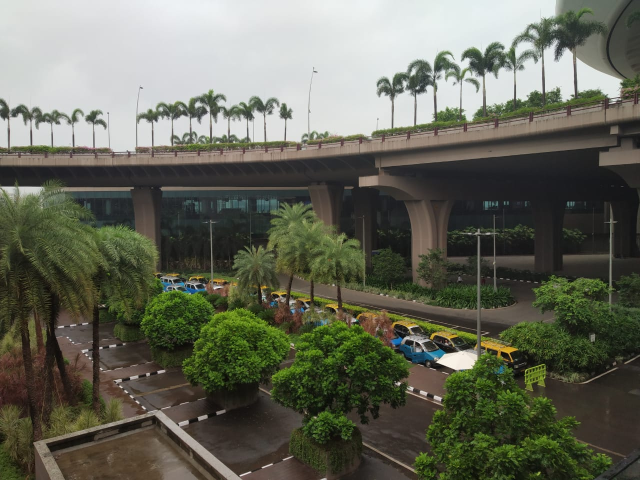

Resize Image to 300px by 300px

>>> img = cv2.imread('data/test.png')
>>> ip = imagewizard.Processing()    
>>> res = ip.resize(img, resize_width=300, resize_height=300, order = 'bgr')
>>> cv2.imshow('Resized Image', res)

Resize Image to height 200px, keeping aspect ratio intact

>>> img = cv2.imread('data/test.png')
>>> ip = imagewizard.Processing()    
>>> res = ip.resize(img, resize_height=200, order = 'bgr')
>>> cv2.imshow('Resized Image', res)

.. |t2_r2| image:: tests/data/processed_images/resize/shrink-200px.png
   :width: 60%

Gray scale
__________

imagewizard provides methods to convert a given color image to gray scale/inverted in various forms such as,

* Inverted Colors
* To Gray/Gray Inverted
* To Binary/Binary Inverted
* To Zero/Zero Inverted
* To Truncated/Truncated Inverted

imagewizard.Processing().img2grayscale(image, to_binary: bool, to_zero: bool, inverted: bool, trunc: bool, is_gray: bool, order: str)

Parameters:

* img: (numpy.array, PIL.image, cv2.image)  
* thresholding_options
      * to_binary: (True/False) - defaults to False, converts the image to a complete black and white image without any shade of gray
      * to_zero: (True/False) - defaults to False, converts an image to zero thresholding if set to True
      * trunc: (True/False) - defaults to False, converts an image to truncated thresholding if set to True
      * inverted: (True/False) - defaults to False, this parameter can be used along with any of the above parameter. If set to True, the colorspace will be inverted
      * is_gray: (True/False) - defaults to True, if set to false and used along with ('inverted' == True) the colorspace of the image will be inverted

      Note: the preference of the parameters follows - truc > to_binary > to_zero. The lower order parameter will be ignored in presence of a parameter with a greater preference. 

* order: (RGB, BGR) input order of the colors. If using PIL to read an image, 'order' need not be specified. **If opencv is used to read an image, 'order' must be set to 'BGR'**  
      Note: The output will be a numpy.array of the same order  

Let us use the famous picture of Lena, to demonstrate gray scaling.

>>> import cv2
>>> img = cv2.imread('original_image.png')
>>> ip = imagewizard.Processing()

>>> inverted_img = ip.img2grayscale(img, inverted=True, is_gray=False, order = 'bgr')
>>> cv.imshow("inverted Image", inverted_img)

================ ================
Original  		 Inverted  		
================ ================
|lenna_org|      |clr_inv|     
================ ================

>>> gray_image = ip.img2grayscale(img, order = 'bgr')
>>> cv2.imshow("Gray", gray_image)

>>> gray_inv_image = ip.img2grayscale(img, inverted=True, order = 'bgr')
>>> cv.imshow("Gray Inverted", gray_inv_image)

================ ================ 
Gray             Gray Inv            
================ ================ 
|gray|      	 |gray_inv|      	 
================ ================ 

>>> trunc_image = ip.img2grayscale(img, trunc=True, order = 'bgr')
>>> cv.imshow("Trucated Threshold", trunc_image)

>>> trunc_inv_image = ip.img2grayscale(img, trunc=True, inverted=True, order = 'bgr')
>>> cv.imshow("Trucated Threshold Inv", trunc_inv_image)

================ ================ 
Truncated        Truncated Inv
================ ================
|trunc|		     |trunc_inv|
================ ================

>>> binary_image = ip.img2grayscale(img, to_binary=True, order = 'bgr')
>>> cv2.imshow("Binary Threshold", binary_image)

>>> binary_inv_image = ip.img2grayscale(img, to_binary=True, inverted=True, order = 'bgr')
>>> cv2.imshow("Binary Threshold Inverted", binary_inv_image)

================ ================  
Binary           Binary Inv      
================ ================ 
|bin_img|		 |bin_inv|	  	 
================ ================ 

>>> to_zero_image = ip.img2grayscale(img, to_zero=True, order = 'bgr')
>>> cv2.imshow("To Zero", to_zero_image)

>>> to_zero_inverted = ip.img2grayscale(img, to_zero=True, inverted = True, order = 'bgr')
>>> cv2.imshow("To Zero Inverted", to_zero_inverted)

================  ================
To Zero      	   To Zero Inv
================  ================
|tz|	 		      |tz_inv|
================  ================

Rotate
______

imagewizard provides method to rotate a given image, with or without scaling. 
The image provided is rotated in anti-clockwise direction by the rotation angle in degree specified.

* ip.Processing().rotate(image, rotation_degree: float, scaling_factor: float, order: str)

Parameters:

* image: (numpy.array, PIL.image, cv2.image)
* rotation_degree: rotation angle (in degrees), the image will be rotate in anti-clockwise direction
* scaling_factor: scale the image to desired factor. set to 1.0 to maintain the original scale of the image. 0.5 to halve the size of the image, to double the size of the image, use 2.0.
* order: (RGB, BGR) input order of the colors. If using PIL to read an image, 'order' need not be specified. **If opencv is used to read an image, 'order' must be set to 'BGR'**

Following code demonstrates rotation,

>>> import cv2
>>> img = cv2.imread('original_image.png')
>>> ip = imagewizard.Processing()

>>> rotate_by_90 = ip.rotate(img, rotation_degree = 90, order='bgr')
>>> cv2.imshow("Rotate by 90 degrees", rotate_by_90)

>>> rotate_by_180 = ip.rotate(img, rotation_degree = 180, order='bgr')
>>> cv2.imshow("Rotate by 180 degrees", rotate_by_180)

>>> rotate_by_270 = ip.rotate(img, rotation_degree = 270, order='bgr')
>>> cv2.imshow("Rotate by 270 degrees", rotate_by_270)

>>> rotate_by_315_scale = ip.rotate(img, rotation_degree = 315, scaling_factor=0.5, order='bgr')
>>> cv2.imshow("Rotate by 315 degrees, scale 0.5x", rotate_by_315_scale)

>>> rotate_by_45_scale = ip.rotate(img, rotation_degree = 45, scaling_factor=2, order='bgr')
>>> cv2.imshow("Rotate by 45 degrees, scale 2x", rotate_by_45_scale)    

================  ================  ================
Original      	   90 deg            180 deg     
================  ================  ================
|lenna_org|       |90deg|           |180deg|        
================  ================  ================

================  =================  ===================
270 deg       	   45 deg, scale 2x   315 deg, scale 0.5x    
================  =================  ===================
|270deg|          |45degs|           |315degs|        
================  =================  ===================

Crop
____ 

imagewizard lets you crop a given image. Provide the starting and ending, X and Y coordinates to crop the image to.

>>> imagewizard.Processing().crop(img: Image, start_x: float, end_x: float, start_y: float, end_y: float, is_percentage: Bool, order: str)

Parameters:

* img: (numpy.array, PIL.image, cv2.image)
* start_x: starting pixel coordinate along the x-axis/width of the image
* end_x: ending pixel coordinate along the x-axis/width of the image
* start_y: starting pixle coordinate along the y-axis/height of the image
* end_y: ending pixle coordinate along the y-axis/height of the image
* is_percentage: if True, the coordinates will be considered as percentages, default: False
* order: (RGB, BGR) input order of the colors. If using PIL to read an image, 'order' need not be specified. If opencv is used to read an image, 'order' must be set to 'BGR'

>>> import cv2
>>> img = cv2.imread('original_image.png')
>>> ip = imagewizard.Processing()

>>> crop1 = ip.crop(img, start_x = 50, end_x = 100, start_y = 50, end_y = 100, is_percentage = True, order='bgr')
>>> cv2.imshow("Crop % (a)", crop1)

>>> crop2 = ip.crop(img, start_x = 400, end_x = 1000, start_y = 0, end_y = 500, is_percentage = False, order='bgr')
>>> cv2.imshow("Crop by px", crop2)

>>> crop3 = ip.crop(img, start_x = 0, end_x = 50, start_y = 0, end_y = 50, is_percentage = True, order='bgr')
>>> cv2.imshow("Crop % (b)", crop3)

================  =================  =================  ===================
Original      	   Crop % (a)         Crop by px         Crop % (b)       
================  =================  =================  ===================
|t2_img|          |crop1|            |crop2|            |crop3|            
================  =================  =================  ===================

Mirror
______ 

imagewizard provides methods to mirror/flip a given image. The image can be flipped around its X-axis or Y-axis or both X and Y axis by providing the flip_code parameter.
The following code demonstrates flipping around various axes.

>>> imagewizard.Processing().mirror(img: Image, flip_code: int, order: str)

Parameters:

* img: (numpy.array, PIL.image, cv2.image)
* flip_code:  
   * = 0 for flipping the image around the y-axis (vertical flipping);
   * > 0 for flipping around the x-axis (horizontal flipping);
   * < 0 for flipping around both axes
* order: (RGB, BGR) input order of the colors. If using PIL to read an image, 'order' need not be specified. **If opencv is used to read an image, 'order' must be set to 'BGR'**

>>> import cv2
>>> img = cv2.imread('original_image.png')
>>> ip = imagewizard.Processing()

>>> mir_x = ip.mirror(img, flip_code=1, order='bgr')
>>> cv.imshow('Horizontal Mirror (X)', mir_x)

>>> mir_y = ip.mirror(img, flip_code=0, order='bgr')
>>> cv.imshow('Vertical Mirror (Y)', mir_y)

>>> mir_xy = ip.mirror(img, flip_code=-1, order='bgr')
>>> cv.imshow('Mirrored both X and Y', mir_xy)

========================  ========================  ========================  ========================
Original      	            Horizontal Mirror (X)     Vertical Mirror (Y)      Mirrored both X and Y 
========================  ========================  ========================  ========================
|lenna_org|                |mir_x|                   |mir_y|                  |mir_xy|               
========================  ========================  ========================  ========================

Blur
____

imagewizard provides methods to blur a given image. The intensity of the blur can be passed as an argument to the function.
The following code demonstrates blurring.

>>> imagewizard.Processing().blur(img: Image, blur_level: int, order: str)

Parameters:

* img: (numpy.array, PIL.image, cv2.image)
* blur_level: (int, > 0 and < 100,000) intensity of blur 
* order: (RGB, BGR) input order of the colors. If using PIL to read an image, 'order' need not be specified. **If opencv is used to read an image, 'order' must be set to 'BGR'**

>>> import cv2
>>> img = cv2.imread('original_image.png')
>>> ip = imagewizard.Processing()

>>> blur_5 = ip.blur(img, blur_level = 5, order='bgr')
>>> cv.imshow('Blur level 5', blur_5)

>>> blur_25 = ip.blur(img, blur_level = 25, order='bgr')
>>> cv.imshow('Blur level 25', blur_25)

>>> blur_50 = ip.blur(img, blur_level = 50, order='bgr')
>>> cv.imshow('Blur level 50', blur_50)

=============  =============  =============  =============
Original       Blur level 5   Blur level 25  Blur level 50
=============  =============  =============  =============
|t2_img|       |blur_5|       |blur_25|      |blur_50|    
=============  =============  =============  =============

Luminosity
__________

imagewizard provides methods to change the luminosity/brightness of a given image. The intensity of the brightness can be passed as an argument to the function. A positive intensity value will brighten the image, whereas a negative value will darken the image.
The following code demonstrates changing the brightness levels.

>>> imagewizard.Processing().luminosity(img: Image, intensity_shift: int, order: str)

Parameters:

* img: (numpy.array, PIL.image, cv2.image)
* intensity_shift: -ve value to darken and +ve value to brighten
* order: (RGB, BGR) input order of the colors. If using PIL to read an image, 'order' need not be specified. **If opencv is used to read an image, 'order' must be set to 'BGR'**

>>> import cv2
>>> img = cv2.imread('original_image.png')
>>> ip = imagewizard.Processing()

>>> lum_100 = ip.luminosity(img, intensity_shift = 100, order = 'bgr')
>>> cv.imshow('Brightness level increased by 100', lum_100)

>>> lum_neg_100 = ip.luminosity(img, intensity_shift = -100, order = 'bgr')
>>> cv.imshow('Brightness level decreased by 100', lum_neg_100)

=================================  =================================  =================================
Brightness level decreased by 100  Original                           Brightness level increased by 100
=================================  =================================  =================================
|lum_neg_100|                      |lenna_org|                        |lum_100|                        
=================================  =================================  =================================

Skew - Perspective
__________________

imagewizard provides methods to perspective tranform an image. You need to provide 4 points on the input image and corresponding points on the output image. Among these 4 points, 3 of them should not be collinear.
Following code demonstrates Perspective Transformation.

>>> imagewizard.Processing().skew_perspective(img: Image, input_points: np.float32, output_points: np.float32, order: str)

Parameters:

* img: (numpy.array, PIL.image, cv2.image)
* input_points: four points on input image, ex: np.float32([[x1,y1],[x2,y2],[x3,y3],[x4,y4]]), (xi, yi are floating point)
* output_points: four points on output location correspoinding to input_points' to be transformed, ex: np.float32([[p1,q1],[p2,q2],[p3,q3],[p4,q4]]), (pi, qi are floating point)
* order: (RGB, BGR) input order of the colors. If using PIL to read an image, 'order' need not be specified. **If opencv is used to read an image, 'order' must be set to 'BGR'**

>>> import cv2
>>> img = cv2.imread('original_image.png')
>>> ip = imagewizard.Processing()

>>> input_points = np.float32([(100, 320), (472, 156), (250, 580), (630, 345)])
>>> output_points = np.float32([[0,0], [500,0], [0,350], [500,350]])

>>> skew_img = ip.skew_perspective(img, input_points = input_points, output_points = output_points, order = 'bgr')
>>> cv.imshow('Perspective Transformation', skew_img)

=================================  =================================
Original                           Perspective Transformation       
=================================  =================================
|skew_per_org|                     |skew_per_tf|                        
=================================  =================================

* The green points on the input image specifies the coordinates of the pixels that will be mapped to output points.
* The coordinates passed in the code above are in the order - TOP LEFT, TOP RIGHT, BOTTOM LEFT, BOTTOM RIGHT
* The corresponding input pixel coordinates are - TL:(100, 320), TR:(472, 156), BL:(250, 580), BR:(630, 345)]
* The corresponding output pixel coordinates are - TL:(0, 0), TR:(500, 0), BL:(0, 350), BR:(500, 350)]

Skew - Affine
_____________

imagewizard provides methods to affine transform an image. In affine transformation, all parallel lines in the original image will still be parallel in the output image. Provide three points from input image and their corresponding locations in output image.
Following code demonstrates Affine Transformation.

>>> imagewizard.Processing().affine(img: Image, input_points: np.float32, output_points: np.float32, order: str)

Parameters:

* img: (numpy.array, PIL.image, cv2.image)
* input_points: three points on input image, ex: np.float32([[x1,y1],[x2,y2],[x3,y3]]), (xi, yi are floating point)
* output_points: three points on output location correspoinding to input_points' to be transformed, np.float32([[p1,q1],[p2,q2],[p3,q3]]), (pi, qi are floating point)
* order: (RGB, BGR) input order of the colors. If using PIL to read an image, 'order' need not be specified. **If opencv is used to read an image, 'order' must be set to 'BGR'**

>>> import cv2
>>> img = cv2.imread('original_image.png')
>>> ip = imagewizard.Processing()

>>> input_points = np.float32([[50,50],[200,50],[50,200]])
>>> output_points = np.float32([[10,100],[200,50],[100,250]])

>>> skew_img = ip.skew_perspective(img, input_points = input_points, output_points = output_points, order = 'bgr')
>>> cv.imshow('Affine Transformation', skew_img)

=================================  =================================
Original                           Affine Transformation       
=================================  =================================
|skew_aff_org|                     |skew_aff_tf|                        
=================================  =================================

* The green points on the input image specifies the coordinates of the pixels that will be mapped to output points.
* The coordinates passed in the code above are in the order - TOP LEFT, TOP RIGHT, BOTTOM LEFT
* The corresponding input pixel coordinates are - TL:(50, 50), TR:(200, 50), BL:(50, 200)]
* The corresponding output pixel coordinates are - TL:(10, 100), TR:(200, 50), BL:(100, 250)]

For more information check this `documentation <https://opencv-python-tutroals.readthedocs.io/en/latest/py_tutorials/py_imgproc/py_geometric_transformations/py_geometric_transformations.html#affine-transformation>`_

Image Analysis
==============

Dominant Colors
_______________

imagewizard provides methods to find the 'n' dominant colors in an image. 
Following code demonstrates using the function to get 'n' dominant colors in an image.

>>> imagewizard.Analysis().dominant_colors(img: Image, no_of_colors: int = 3, order: str = 'rgb')

Parameters:

* img: (numpy.array, PIL.image, cv2.image)
* no_of_colors: (int) no of dominant colors RGB to return
* order: (RGB, BGR) input order of the colors. If using PIL to read an image, 'order' need not be specified. **If opencv is used to read an image, 'order' must be set to 'BGR'**

>>> import cv2
>>> from PIL import Image
>>> img_cv = cv2.imread('original_image.png')
>>> img_pil = Image.open("original_image.png")

>>> imanalysis = imagewizard.Analysis()
>>> img_cv_result = imanalysis.dominant_colors(img_pil, 3, 'bgr')
>>> img_pil_result = imanalysis.dominant_colors(img_cv, 3, 'rgb')

>>> print("CV image - dominant colors (RGB) : ", img_cv_result)
CV image - dominant colors (RGB) : [[224 166 147]
 [110  34  71]
 [195  98 100]]

=============  ================ ================ ================ ================
Original       Clustered Image  Color 1          Color 2          Color 3
=============  ================ ================ ================ ================
|lenna_org|    |clustered_im|   |cv_dom_c0|      |cv_dom_c1|      |cv_dom_c2|                        
=============  ================ ================ ================ ================

* The Clustered Image can be constructed with `Segmentation <https://github.com/PriceSpider-NeuIntel/imagewizard#segmentation>`_ method of imagewizard

>>> print("PIL image - dominant colors (RGB) : ", img_pil_result)
PIL image - dominant colors (RGB) : [[224 166 147]
 [110  34  71]
 [195  98 100]]

=============  ================ ================ ================ ================
Original       Clustered Image  Color 1          Color 2          Color 3
=============  ================ ================ ================ ================
|lenna_org|    |clustered_im|   |pil_dom_c0|     |pil_dom_c1|     |pil_dom_c2|                        
=============  ================ ================ ================ ================

Average/Mean Color
__________________

imagewizard provides methods that calculates and returns the mean/average color of an image
Following code demonstrates using the function to get the average pixel color in RGB

>>> imagewizard.Analysis().mean_color(img: Image, order: str = 'rgb')

Parameters:

* img: (numpy.array, PIL.image, cv2.image)
* order: (RGB, BGR) input order of the colors. If using PIL to read an image, 'order' need not be specified. **If opencv is used to read an image, 'order' must be set to 'BGR'**

Returns:

* Tuple of RGB values of the mean color calculated

>>> import cv2
>>> from PIL import Image
>>> img_cv = cv2.imread('original_image.png')
>>> img_pil = Image.open("original_image.png")

>>> imanalysis = imagewizard.Analysis()
>>> img_cv_result = imanalysis.mean_color(img_pil, 'bgr')
>>> img_pil_result = imanalysis.mean_color(img_cv, 'rgb')

>>> print("PIL image - mean color (RGB) :", img_cv_result)
PIL image - mean color (RGB) : (180, 99, 105)

>>> print("CV image - mean color (RGB) :", img_cv_result)
CV image - mean color (RGB) : (180, 99, 105)

===================  ===================
Original             Average/Mean Color    
===================  ===================     
|lenna_org_ave|      |lenna_result_ave|
===================  ===================    

Frequent Color
______________

imagewizard provides methods that calculates and returns the frequent/mode color of an image
Following is the demonstration code,

>>> imagewizard.Analysis().frequent_color(img: Image, order: str = 'rgb')

Parameters:

* img: (numpy.array, PIL.image, cv2.image)
* order: (RGB, BGR) input order of the colors. If using PIL to read an image, 'order' need not be specified. **If opencv is used to read an image, 'order' must be set to 'BGR'**

Returns:

* Tuple of RGB values of the mode color calculated

>>> import cv2
>>> from PIL import Image
>>> img_cv = cv2.imread('original_image.png')
>>> img_pil = Image.open("original_image.png")

>>> imanalysis = imagewizard.Analysis()
>>> img_cv_result = imanalysis.frequent_color(img_pil, 'bgr')
>>> img_pil_result = imanalysis.frequent_color(img_cv, 'rgb')

>>> print("PIL image - frequent color (RGB) :", img_cv_result)
PIL image - frequent color (RGB) : (88, 18, 60)

>>> print("CV image - frequent color (RGB) :", img_cv_result)
CV image - frequent color (RGB) : (88, 18, 60)

===================  ===================      
Original             Frequent/Mode Color    
===================  ===================      
|lenna_org_mode|     |lenna_result_mode|
===================  ===================  

Trim/Crop to Content
____________________

imagewizard provides methods to Trim/Crop an image to its content (removes uniform color spaced padding around the image) 
Following code demonstrates using the function to trim an image

>>> imagewizard.Analysis().trim_to_content(img: Image, order: str = 'rgb')

Parameters:

* img: (numpy.array, PIL.image, cv2.image)
* order: (RGB, BGR) input order of the colors. If using PIL to read an image, 'order' need not be specified. **If opencv is used to read an image, 'order' must be set to 'BGR'**

Returns:

* PIL/numpy.array of the order specified

>>> import cv2
>>> from PIL import Image
>>> img_cv = cv2.imread('original_image.png')
>>> img_pil = Image.open("original_image.png")

>>> imanalysis = imagewizard.Analysis()
>>> img_cv_result = imanalysis.trim_to_content(img_cv, 'bgr')
>>> img_pil_result = imanalysis.trim_to_content(img_pil)

>>> cv.imshow("original", img_cv)
>>> cv.imshow("Trimmed Image", img_cv_result)
>>> img_pil_result.show()

================  =================
Original          Trimmed Image    
----------------  -----------------
|quite_flow_org|  |quite_flow_trim| 
================  =================

================  =================
Original          Trimmed Image    
----------------  -----------------
|san_disk_org|    |san_disk_trim|
================  =================

.. _a Hash: http://www.hackerfactor.com/blog/index.php?/archives/432-Looks-Like-It.html
.. _p Hash: http://www.hackerfactor.com/blog/index.php?/archives/432-Looks-Like-It.html
.. _d Hash: http://www.hackerfactor.com/blog/index.php?/archives/529-Kind-of-Like-That.html
.. _w Hash: https://fullstackml.com/2016/07/02/wavelet-image-hash-in-python/
.. _distance algorithms: https://dataconomy.com/2015/04/implementing-the-five-most-popular-similarity-measures-in-python/
.. _pypi: https://pypi.python.org/pypi/

.. |lenna_org| image:: tests/data/original_images/lenna.png

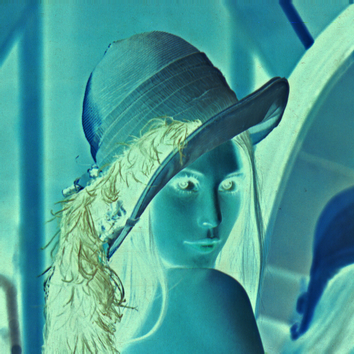

.. |gray| image:: tests/data/processed_images/gray/gray.png

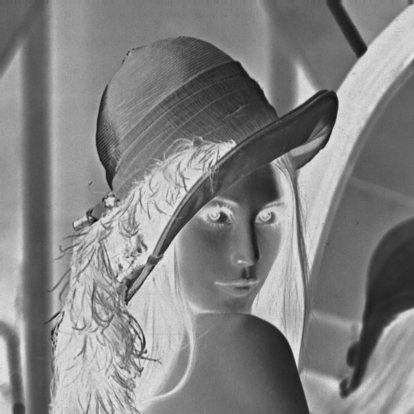

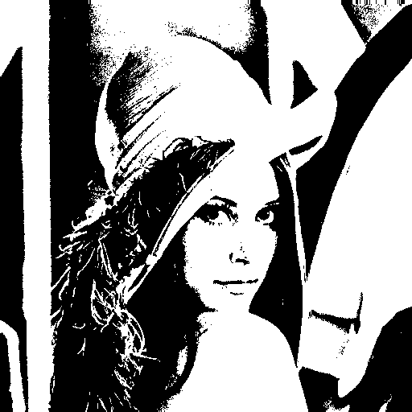

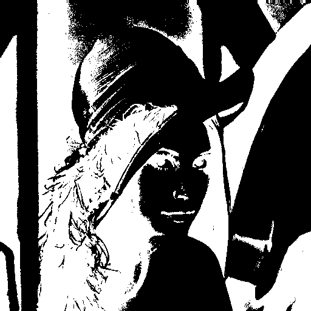

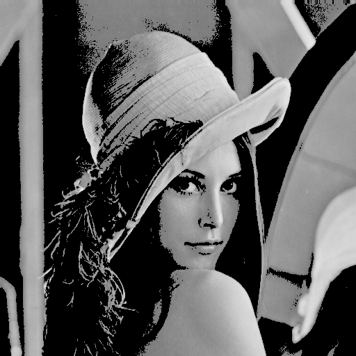

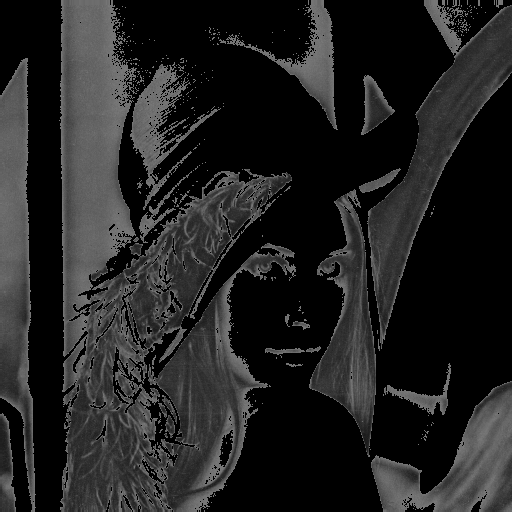

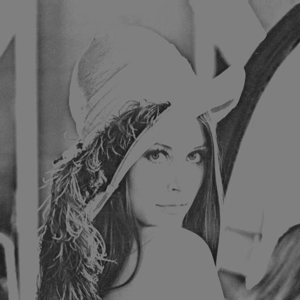

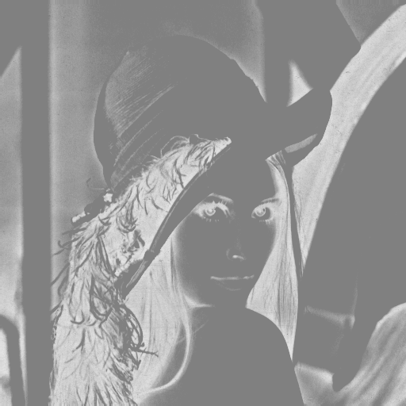

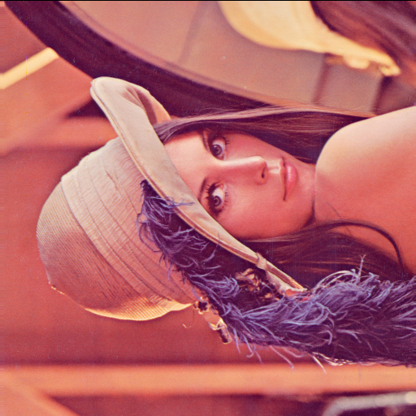

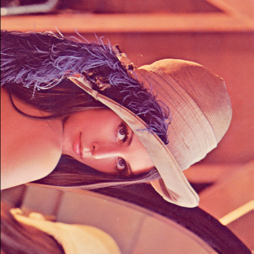

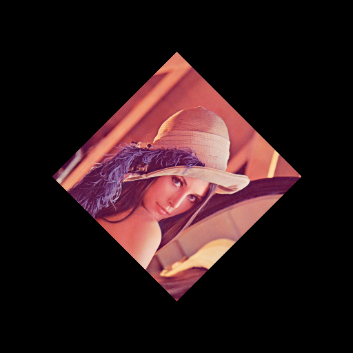

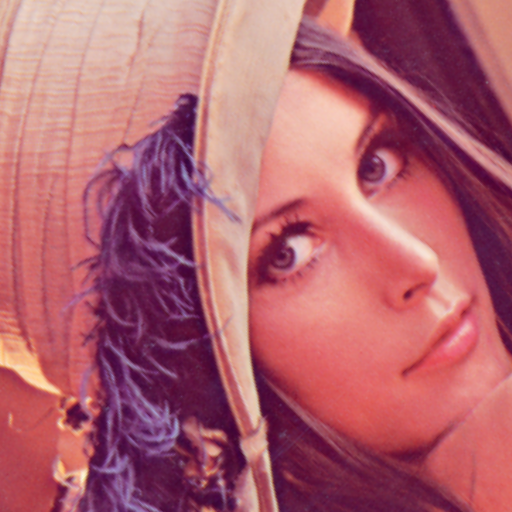

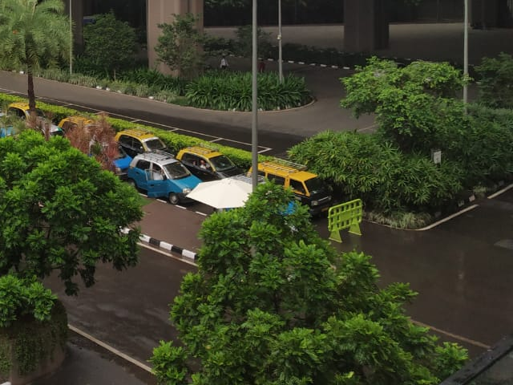

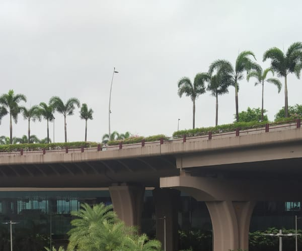

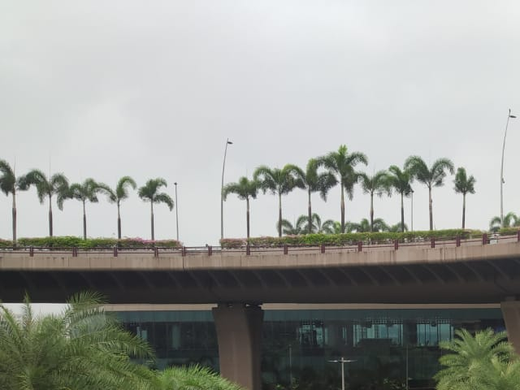

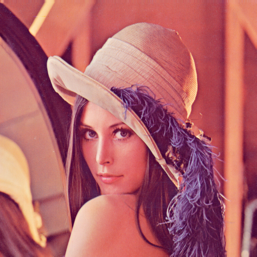

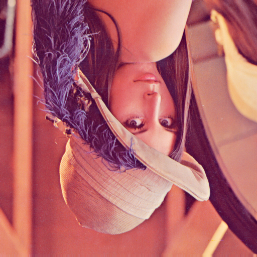

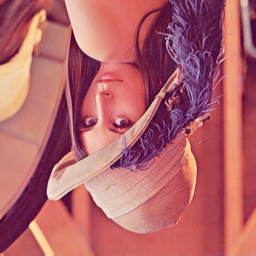

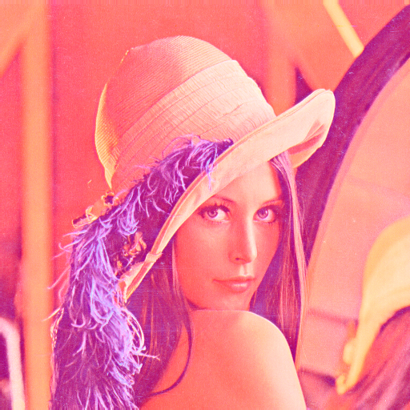

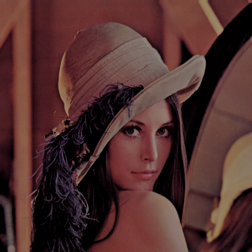

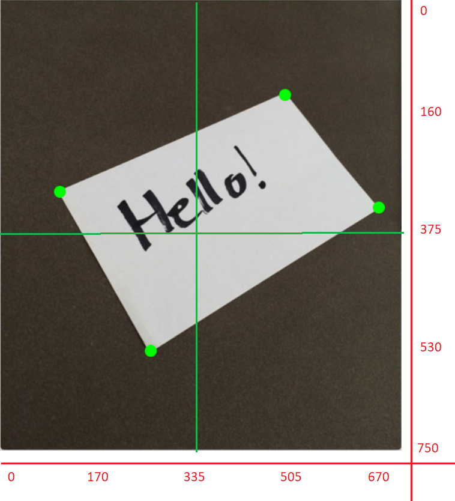

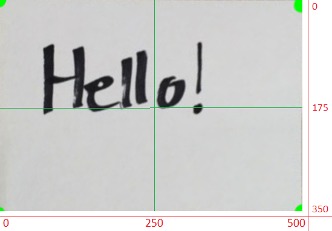

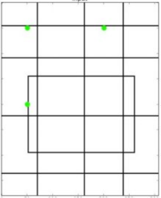

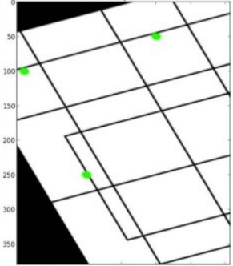

.. ########## dominant colors ###########

.. ########## mean colors ###########
.. |lenna_org_ave| image:: tests/data/analysed_images/mean/lenna-original-ave.jpg

.. ########## frerquent colors ###########
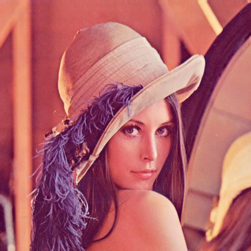

.. ########## crop/trim to content ###########

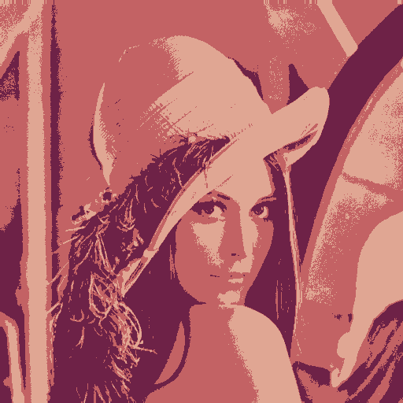
